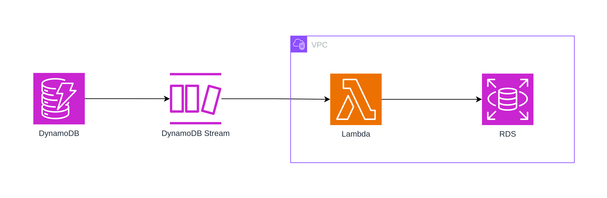

# Streaming de dados do DynamoDB para o RDS

A imagem abaixo ilustra uma sugestão de arquitetura para envio de dados do DynamoDB para o RDS.

Para isso utiliza-se a funcionalidade de streaming (DynamoDB Streams) que irá invocar uma função Lambda a cada modificação de dados que ocorrer na tabela.

A função Lambda recebe o streaming de notificações (criação, modificação e remoção) e realiza a gravação dos dados no banco de dados RDS.

Essa configuração é realizada a partir do DynamoDB Stream, onde é possível definir a função Lambda que receberá os dados e qual a quantidade de registros (batch size).

Em caso de erro na função Lambda, o serviço irá efetuar retentativas até que seja processado com sucesso ou os dados expirarem (TTL).

## Migração

No caso de a tabela no DynamoDB já possuir dados, e estes precisarem ser replicados, pode-se usar a opção de exportar a tabela para um bucket S3 e importar para o RDS usando um script.

A exportação para o S3 não consome RCUs e não possui impacto na performance da tabela, sendo uma boa opção mesmo que esse processo seja repetido mais vezes.
